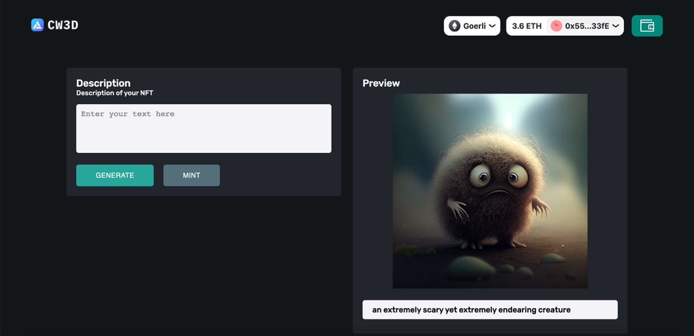

I made this project for the [Alchemy The SDK Developer Challenge](https://www.alchemy.com/sdk-developer-challenge). It is a simple NFT marketplace that allows users to generate NFT using Dall-E and mint NFTs to sell them on the marketplace. It is built on the Alchemy SDK and uses the Goerli network.

### Preview



# Installation

### Clone the repository and install the dependencies.

```bash
git clone https://github.com/abdibrokhim/cw3d-AlchemySDK
```

## Go to the project directory

```bash
cd alNFT
```

## FRONTEND

```
cd frontend
```

## Install dependencies

```bash
npm install
```

## Start the server

```bash
npm run dev
```

it will start the server on port 3000

---

## BACKEND

```
cd backend
```

## Install dependencies

```bash
npm install
```

## Start the server

```bash
node api/api.js
```

it will start the server on port 3005

<br/>


All donations are Greatly Appreciated! 💛 


<a href="https://www.buymeacoffee.com/abdibrokhim" target="_blank"></a>

<br/>